# 가입 및 인증 프로세스

## 개요

업무 보고 시스템은 **Supabase Auth**를 사용한 인증 시스템과 자체 **역할 기반 권한 관리(RBAC)** 시스템을 결합하여 사용합니다.

## 인증 아키텍처

```
┌─────────────────┐
│ Supabase Auth   │ ← 인증 (Authentication)
│ - 이메일/비밀번호  │
│ - 세션 관리       │
└────────┬────────┘
         │
         ↓
┌─────────────────┐
│ MEMBER_TBL      │ ← 사용자 정보
│ - auth_id       │
│ - role_id       │
│ - is_active     │
└────────┬────────┘
         │
         ↓
┌─────────────────┐
│ ROLE_TBL        │ ← 역할 및 권한 (Authorization)
│ - role_id       │
│ - permissions   │
└─────────────────┘
```

## 현재 구현된 인증 방식

### 1. Supabase Email/Password 인증

#### 특징
- Supabase가 제공하는 기본 이메일/비밀번호 인증
- 이메일 확인 필수 (email verification)
- 비밀번호 재설정 기능 내장
- 세션 관리 자동화

#### 흐름

```mermaid
sequenceDiagram
    participant User
    participant Frontend
    participant Supabase
    participant Database

    User->>Frontend: 회원가입 요청
    Frontend->>Supabase: signUp(email, password)
    Supabase->>User: 확인 이메일 발송
    User->>Supabase: 이메일 확인 링크 클릭
    Supabase->>Database: auth.users 생성
    Note over Database: auth_id 생성됨
```


### 2. 회원가입 프로세스

#### Step 1: Supabase 계정 생성
```typescript
// Frontend: src/components/SignUpForm.tsx (구현 예정)
const { data, error } = await supabase.auth.signUp({
  email: 'user@example.com',
  password: 'securePassword123',
  options: {
    data: {
      name: '홍길동'
    }
  }
});
```

**결과**:
- Supabase `auth.users` 테이블에 사용자 생성
- `auth_id` (UUID) 생성
- 이메일 확인 대기 상태

#### Step 2: 이메일 확인
- 사용자가 이메일에서 확인 링크 클릭
- Supabase가 이메일 확인 처리
- `email_confirmed_at` 타임스탬프 기록

#### Step 3: 회원 정보 생성 (Trigger or Manual)

**Option A: Database Trigger 사용 (권장)**
```sql
-- Supabase에서 실행
CREATE OR REPLACE FUNCTION public.handle_new_user()
RETURNS trigger AS $$
BEGIN
  INSERT INTO public.members (auth_id, email, name, is_active)
  VALUES (
    NEW.id,
    NEW.email,
    NEW.raw_user_meta_data->>'name',
    false  -- 기본값: 비활성
  );
  RETURN NEW;
END;
$$ LANGUAGE plpgsql SECURITY DEFINER;

CREATE TRIGGER on_auth_user_created
  AFTER INSERT ON auth.users
  FOR EACH ROW
  EXECUTE FUNCTION public.handle_new_user();
```

**Option B: Frontend에서 수동 생성**
```typescript
// 이메일 확인 후
const { user } = await supabase.auth.getUser();
if (user && user.email_confirmed_at) {
  await memberAPI.createMember({
    auth_id: user.id,
    email: user.email,
    name: user.user_metadata.name,
    is_active: false
  });
}
```

**결과**:
- `MEMBER_TBL`에 레코드 생성
- `auth_id`: Supabase user ID 연결
- `is_active`: `false` (관리자 승인 대기)
- `role_id`: `NULL` (역할 미할당)

#### Step 4: 관리자 승인 대기
```typescript
// 로그인 시도
const { data: { session } } = await supabase.auth.signInWithPassword({
  email: 'user@example.com',
  password: 'password'
});

// 회원 정보 조회
const member = await memberAPI.getCurrentMember();

if (!member.is_active || !member.role_id) {
  // 승인 대기 화면 표시
  return <PendingApprovalScreen />;
}
```

#### Step 5: 관리자가 승인
```typescript
// 관리자가 사용자 관리 페이지에서
await memberAPI.updateMember(memberId, {
  role_id: 3, // Employee 역할
  is_active: true
});
```

**결과**:
- 사용자가 시스템 접근 가능
- 할당된 역할의 권한에 따라 메뉴 표시

### 3. 로그인 프로세스

```mermaid
sequenceDiagram
    participant User
    participant Frontend
    participant Supabase
    participant Database
    participant App

    User->>Frontend: 로그인 (email, password)
    Frontend->>Supabase: signInWithPassword()
    Supabase->>Frontend: Session (JWT)
    Frontend->>Database: getCurrentMember()
    Database->>Frontend: Member + Role + Permissions

    alt 비활성 또는 역할 없음
        Frontend->>App: PendingApprovalScreen
    else 활성 + 역할 있음
        Frontend->>App: Dashboard
    end
```



#### 코드 구현 (현재)
```typescript
// src/providers/AuthProvider.tsx
export function AuthProvider({ children }: AuthProviderProps) {
  const [user, setUser] = useState<User | null>(null);
  const [loading, setLoading] = useState(true);

  useEffect(() => {
    // 세션 확인
    supabase.auth.getSession().then(({ data: { session } }) => {
      setUser(session?.user ?? null);
      setLoading(false);
    });

    // 인증 상태 변경 감지
    const { data: { subscription } } = supabase.auth.onAuthStateChange(
      (_event, session) => {
        setUser(session?.user ?? null);
      }
    );

    return () => subscription.unsubscribe();
  }, []);

  // ...
}
```

## 가입 방식 비교

### 방식 1: 자체 가입 (현재 구현)

**특징**:
- 누구나 이메일/비밀번호로 가입 가능
- 가입 시 Pending User 역할(role_id=4) 자동 할당
- `is_active=false`로 설정되어 승인 대기 상태
- 관리자 승인 전까지 모든 기능 차단

**장점**:
- 구현이 간단함
- Supabase 기본 기능 활용
- 이메일 확인 자동화

**단점**:
- 누구나 가입 가능 (스팸 가능성)
- 관리자 승인 필요

### 방식 2: Supabase Auth 초대 (현재 구현)

**특징**:
- 관리자가 `inviteUserByEmail` API로 초대
- Supabase가 초대 이메일 자동 발송
- 역할 사전 할당 (`invited=true`, role_id 지정)
- `is_active=true`로 설정되어 즉시 활성화

**장점**:
- 관리자가 통제 가능
- 스팸 방지
- 역할 사전 할당 가능
- Supabase가 보안 토큰 및 이메일 자동 처리

**단점**:
- 이메일 발송 필수 (SMTP 설정 필요)

**구현 방법**:
```typescript
// 관리자가 초대
const { data, error } = await supabase.auth.admin.inviteUserByEmail(
  'user@example.com',
  {
    data: {
      role_id: 3,
      name: '홍길동',
      invited: true
    },
    redirectTo: `${window.location.origin}/auth/callback`
  }
);
```

### 방식 3: 소셜 로그인 (구현 가능)

**지원 플랫폼**:
- Google
- GitHub
- Microsoft Azure
- 기타 OAuth 제공자

**장점**:
- 사용자 편의성
- 비밀번호 관리 불필요
- 이메일 확인 자동

**구현 예시**:
```typescript
// Google 로그인
const { data, error } = await supabase.auth.signInWithOAuth({
  provider: 'google',
  options: {
    redirectTo: 'http://localhost:5173/auth/callback'
  }
});
```

## 현재 구현 상태 (완료)

### ✅ Phase 1: 인증 시스템
- ✅ Supabase Email/Password 인증
- ✅ 역할 기반 권한 시스템 (RBAC)
- ✅ 권한 기반 메뉴 필터링

### ✅ Phase 2: 자체 가입 및 승인 프로세스
- ✅ 신규 사용자 대기 화면 (`PendingApprovalScreen`)
- ✅ Pending User 역할 (role_id=4) 생성
- ✅ 자체 가입 시 Pending User 자동 할당
- ✅ 관리자 승인 UI (MemberList)
- ✅ Auth 트리거로 members 자동 생성

### ✅ Phase 3: Supabase Auth 초대 시스템
- ✅ `inviteUserByEmail` API 사용
- ✅ 역할 사전 할당
- ✅ 초대 생성 UI (MemberList)
- ✅ 이메일 자동 발송

### 📋 Phase 4: 추가 기능 (선택)
- [ ] 소셜 로그인 (Google, GitHub 등)
- [ ] 2단계 인증 (2FA)
- [ ] 비밀번호 정책 강화
- [ ] 이메일 템플릿 커스터마이징

## Database Schema

### auth.users (Supabase 관리)
```sql
id              UUID PRIMARY KEY
email           VARCHAR UNIQUE
encrypted_password VARCHAR
email_confirmed_at TIMESTAMP
created_at      TIMESTAMP
```

### members (MEMBER_TBL)
```sql
member_id       SERIAL PRIMARY KEY
auth_id         UUID UNIQUE REFERENCES auth.users(id)
account_id      VARCHAR -- 선택적 (legacy)
name            VARCHAR NOT NULL
email           VARCHAR UNIQUE NOT NULL
mobile          VARCHAR
role_id         INTEGER REFERENCES roles(role_id)
is_active       BOOLEAN DEFAULT false
created_at      TIMESTAMP DEFAULT NOW()
updated_at      TIMESTAMP DEFAULT NOW()
```

### roles (역할 테이블)
```sql
role_id         SERIAL PRIMARY KEY
name            VARCHAR NOT NULL
description     TEXT
is_active       BOOLEAN DEFAULT true
created_at      TIMESTAMP DEFAULT NOW()
updated_at      TIMESTAMP DEFAULT NOW()

-- 기본 역할
1: Admin (관리자)
2: Manager (매니저)
3: Employee (직원)
4: Pending User (승인 대기, 권한 없음)
```

## 보안 고려사항

### 1. Row Level Security (RLS)
```sql
-- members 테이블 RLS 정책
ALTER TABLE members ENABLE ROW LEVEL SECURITY;

-- 자신의 정보만 조회 가능
CREATE POLICY "Users can view own member data"
ON members FOR SELECT
USING (auth.uid() = auth_id);

-- 관리자는 모든 회원 조회 가능
CREATE POLICY "Admins can view all members"
ON members FOR SELECT
USING (
  EXISTS (
    SELECT 1 FROM members m
    JOIN roles r ON m.role_id = r.role_id
    JOIN role_permissions rp ON r.role_id = rp.role_id
    JOIN permissions p ON rp.permission_id = p.permission_id
    WHERE m.auth_id = auth.uid()
    AND p.key = 'member.read'
    AND rp.read_access = true
  )
);
```

### 2. API 권한 검증
```typescript
// 서버 측 검증 (예정)
async function requirePermission(
  permission: string,
  access: 'read' | 'write'
) {
  const user = await getCurrentUser();
  const hasPermission = await checkUserPermission(
    user.id,
    permission,
    access
  );

  if (!hasPermission) {
    throw new ForbiddenError('권한이 없습니다.');
  }
}
```

### 3. Frontend 권한 검증
```typescript
// 이미 구현됨: usePermissions hook
const { canRead, canWrite } = usePermissions();

if (!canWrite('task.write')) {
  return <AccessDenied />;
}
```

## 문제 해결 가이드

### Q: 가입했는데 로그인이 안 돼요
**A**: 이메일 확인 링크를 클릭했는지 확인하세요. Supabase는 기본적으로 이메일 확인을 요구합니다.

### Q: 로그인은 되는데 화면이 비어있어요
**A**: 관리자가 역할을 할당하지 않았을 수 있습니다. 관리자에게 연락하여 승인을 요청하세요.

### Q: 특정 메뉴가 안 보여요
**A**: 현재 역할에 해당 메뉴의 권한이 없습니다. 필요시 관리자에게 권한 요청하세요.

### Q: 관리자 계정은 어떻게 만드나요?
**A**:
1. 첫 사용자가 가입
2. Database에서 직접 역할 할당:
```sql
-- Supabase SQL Editor에서 실행
UPDATE members
SET role_id = 1, is_active = true  -- 1 = Admin 역할
WHERE email = 'admin@example.com';
```

## 참고 자료

- [Supabase Auth 문서](https://supabase.com/docs/guides/auth)
- [Row Level Security 가이드](https://supabase.com/docs/guides/auth/row-level-security)
- 내부 문서: `authorization-system.md`
- 내부 문서: `security-design.md`
