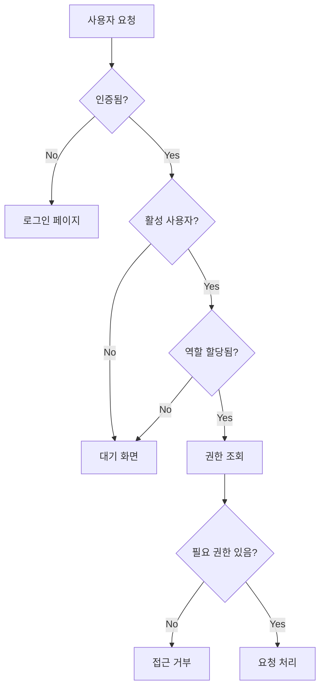

# 권한 체계 및 역할 정의

## 개요

업무 보고 시스템은 **역할 기반 접근 제어(RBAC, Role-Based Access Control)** 방식을 사용합니다. 사용자는 하나의 역할을 가지며, 역할에 할당된 권한에 따라 시스템의 기능과 데이터에 접근할 수 있습니다.

## 역할 체계

### 1. 관리자 (Admin)
**설명**: 시스템의 모든 기능을 관리하고 제어할 수 있는 최고 권한

**접근 가능 메뉴**:
- 📊 대시보드
- 📋 업무 보고
- ➕ 업무 등록
- 💰 청구 그룹 관리
- 🔧 서비스 관리
- 📁 프로젝트 관리
- 👥 사용자 관리
- 🔐 역할 관리
- 🧪 데이터 테스트

**권한 목록**:
| 권한 키 | 권한 명 | 읽기 | 쓰기 |
|---------|---------|------|------|
| task.read | 업무 조회 | ✅ | - |
| task.write | 업무 등록/수정 | - | ✅ |
| project.read | 프로젝트 조회 | ✅ | - |
| project.write | 프로젝트 관리 | - | ✅ |
| member.read | 사용자 조회 | ✅ | - |
| member.write | 사용자/역할 관리 | - | ✅ |

### 2. 매니저 (Manager)
**설명**: 프로젝트, 서비스, 청구 그룹을 관리하는 중간 관리자 역할

**접근 가능 메뉴**:
- 📊 대시보드
- 📋 업무 보고
- ➕ 업무 등록
- 💰 청구 그룹 관리
- 🔧 서비스 관리
- 📁 프로젝트 관리

**권한 목록**:
| 권한 키 | 권한 명 | 읽기 | 쓰기 |
|---------|---------|------|------|
| task.read | 업무 조회 | ✅ | - |
| task.write | 업무 등록/수정 | - | ✅ |
| project.read | 프로젝트 조회 | ✅ | - |
| project.write | 프로젝트 관리 | - | ✅ |

**제한 사항**:
- 사용자 관리 불가
- 역할 관리 불가

### 3. 직원 (Employee)
**설명**: 일반 직원으로 업무 등록과 보고만 가능

**접근 가능 메뉴**:
- 📊 대시보드
- 📋 업무 보고
- ➕ 업무 등록

**권한 목록**:
| 권한 키 | 권한 명 | 읽기 | 쓰기 |
|---------|---------|------|------|
| task.read | 업무 조회 | ✅ | - |
| task.write | 업무 등록/수정 | - | ✅ |

**제한 사항**:
- 프로젝트 관리 불가
- 서비스 관리 불가
- 청구 그룹 관리 불가
- 사용자 관리 불가
- 자신의 업무만 조회/수정 가능 (다른 사용자 업무는 조회만 가능)

### 4. 신규 사용자 (New User / Pending)
**설명**: 가입 후 관리자의 승인을 대기 중인 사용자

**접근 가능 메뉴**: 없음

**권한 목록**: 없음

**상태**:
- `is_active: false` (비활성 상태)
- `role_id: NULL` 또는 특별한 "대기중" 역할

**제한 사항**:
- 시스템 접근 불가
- 대기 화면만 표시
- 관리자의 승인 후 역할이 부여되면 활성화됨

## 권한 키 상세 설명

### task.read (업무 조회)
- **기능**: 업무 목록 조회, 대시보드 통계 조회
- **범위**:
  - 관리자/매니저: 모든 업무 조회 가능
  - 직원: 자신의 업무 + 다른 사용자 업무 읽기 전용

### task.write (업무 등록/수정)
- **기능**: 업무 등록, 수정, 삭제
- **범위**:
  - 관리자/매니저: 모든 업무 수정 가능
  - 직원: 자신의 업무만 수정 가능

### project.read (프로젝트 조회)
- **기능**: 프로젝트, 서비스, 청구 그룹 목록 조회
- **범위**: 전체 프로젝트 구조 조회

### project.write (프로젝트 관리)
- **기능**: 프로젝트, 서비스, 청구 그룹 생성/수정/삭제
- **범위**: 전체 프로젝트 구조 관리

### member.read (사용자 조회)
- **기능**: 사용자 목록 조회
- **범위**: 전체 사용자 정보 조회

### member.write (사용자/역할 관리)
- **기능**: 사용자 등록/수정/비활성화, 역할 관리, 권한 설정
- **범위**: 전체 사용자 및 권한 시스템 관리

## 권한 검증 플로우



## Sidebar 메뉴 권한 매핑

```typescript
const MENU_ITEMS = [
  {
    name: '대시보드',
    href: '/',
    requiredPermission: 'task.read',
    requireReadOnly: true
  },
  {
    name: '업무 보고',
    href: '/tasks',
    requiredPermission: 'task.read',
    requireReadOnly: true
  },
  {
    name: '업무 등록',
    href: '/tasks/new',
    requiredPermission: 'task.write',
    requireReadOnly: false
  },
  {
    name: '청구 그룹',
    href: '/cost-groups',
    requiredPermission: 'project.read',
    requireReadOnly: true
  },
  {
    name: '서비스',
    href: '/services',
    requiredPermission: 'project.read',
    requireReadOnly: true
  },
  {
    name: '프로젝트',
    href: '/projects',
    requiredPermission: 'project.read',
    requireReadOnly: true
  },
  {
    name: '사용자 관리',
    href: '/members',
    requiredPermission: 'member.read',
    requireReadOnly: true
  },
  {
    name: '역할 관리',
    href: '/roles',
    requiredPermission: 'member.write',
    requireReadOnly: false
  }
];
```

## 역할별 접근 매트릭스

| 기능 | 관리자 | 매니저 | 직원 | 신규 사용자 |
|------|--------|--------|------|-------------|
| 대시보드 조회 | ✅ | ✅ | ✅ | ❌ |
| 업무 조회 (전체) | ✅ | ✅ | ❌ | ❌ |
| 업무 조회 (본인) | ✅ | ✅ | ✅ | ❌ |
| 업무 등록 | ✅ | ✅ | ✅ | ❌ |
| 업무 수정 (전체) | ✅ | ✅ | ❌ | ❌ |
| 업무 수정 (본인) | ✅ | ✅ | ✅ | ❌ |
| 업무 삭제 | ✅ | ✅ | ❌ | ❌ |
| 청구 그룹 조회 | ✅ | ✅ | ❌ | ❌ |
| 청구 그룹 관리 | ✅ | ✅ | ❌ | ❌ |
| 서비스 조회 | ✅ | ✅ | ❌ | ❌ |
| 서비스 관리 | ✅ | ✅ | ❌ | ❌ |
| 프로젝트 조회 | ✅ | ✅ | ❌ | ❌ |
| 프로젝트 관리 | ✅ | ✅ | ❌ | ❌ |
| 사용자 조회 | ✅ | ❌ | ❌ | ❌ |
| 사용자 관리 | ✅ | ❌ | ❌ | ❌ |
| 역할 관리 | ✅ | ❌ | ❌ | ❌ |
| 권한 관리 | ✅ | ❌ | ❌ | ❌ |

## 데이터 수준 권한 (Row Level Security)

### 업무(Task) 데이터
- **관리자/매니저**: 모든 업무 접근 가능
- **직원**: `WHERE member_id = 현재사용자ID` 조건 자동 적용
  - 조회: 모든 업무 조회 가능 (읽기 전용)
  - 수정/삭제: 본인 업무만 가능

### 프로젝트/서비스/청구그룹 데이터
- **관리자/매니저**: 모든 데이터 접근 가능
- **직원**: 접근 불가

### 사용자(Member) 데이터
- **관리자**: 모든 사용자 접근 가능
- **매니저/직원**: 접근 불가

## 구현 상태

### ✅ 구현 완료
- [x] 역할 기반 권한 시스템 (RBAC)
- [x] 권한 기반 Sidebar 메뉴 필터링
- [x] usePermissions 훅
- [x] 역할 관리 UI (생성, 수정, 삭제)
- [x] 권한 할당 UI
- [x] 사용자별 역할 할당

### 🚧 구현 필요
- [ ] 신규 사용자 대기 화면
- [ ] 관리자 승인 프로세스
- [ ] 직원 권한의 데이터 수준 필터링 (본인 업무만 수정)
- [ ] 페이지 수준 권한 검증 (ProtectedRoute 개선)
- [ ] API 호출 시 권한 검증

## 참고 사항

### 역할 생성 방법
1. 관리자 계정으로 로그인
2. "역할 관리" 메뉴 접근
3. "새 역할" 버튼 클릭
4. 역할명, 설명 입력
5. 필요한 권한 선택 (읽기/쓰기)
6. 저장

### 사용자 역할 할당 방법
1. 관리자 계정으로 로그인
2. "사용자 관리" 메뉴 접근
3. 사용자 선택
4. "수정" 버튼 클릭
5. 역할 드롭다운에서 선택
6. 저장

### 신규 사용자 승인 프로세스 (예정)
1. 사용자가 Supabase Auth를 통해 가입
2. MEMBER_TBL에 `is_active: false`, `role_id: NULL`로 생성
3. 신규 사용자는 "승인 대기 중" 화면만 표시
4. 관리자가 "사용자 관리"에서 역할 할당 및 활성화
5. 사용자가 시스템 접근 가능
