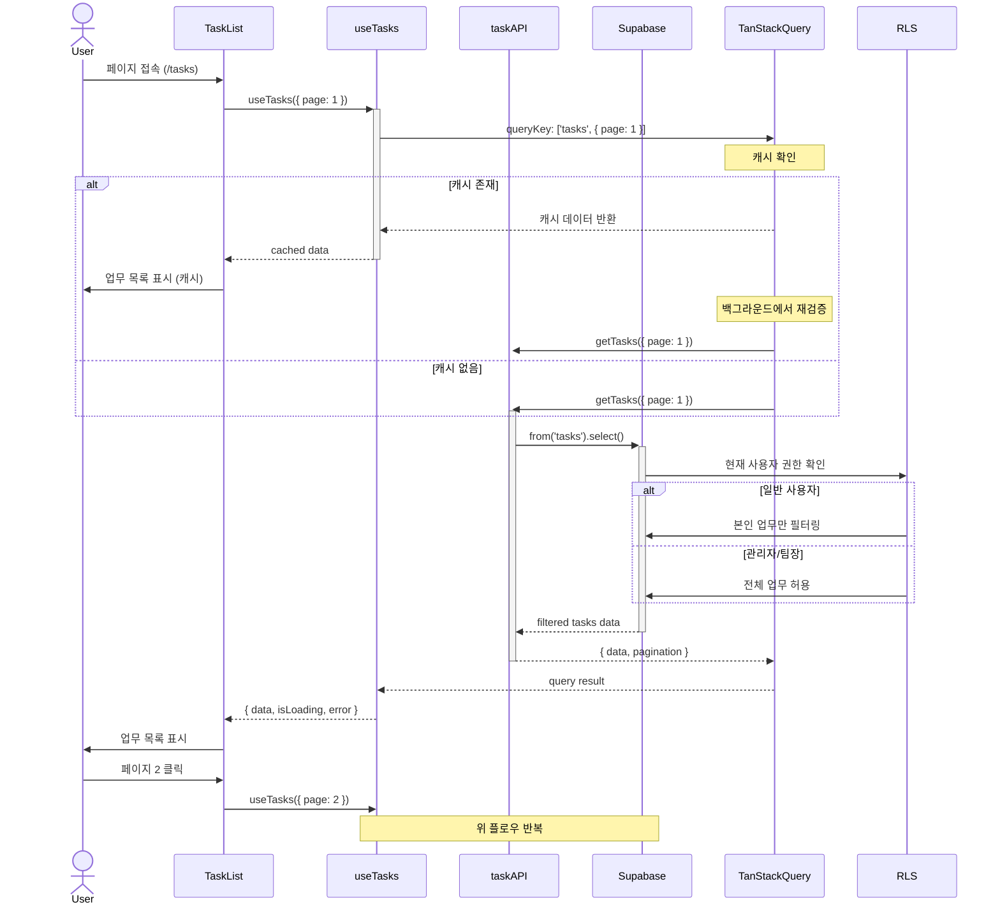
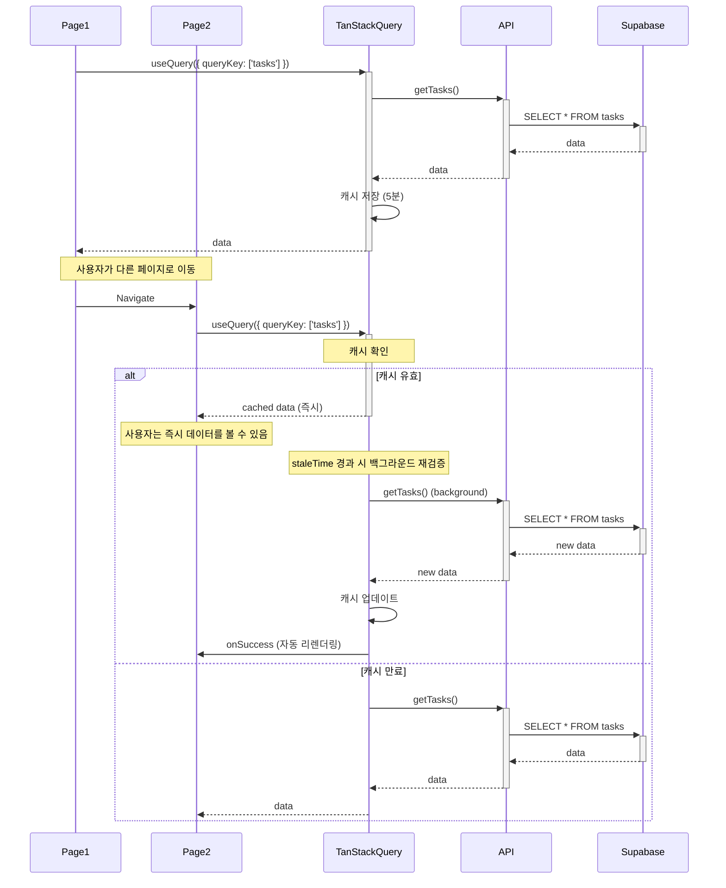
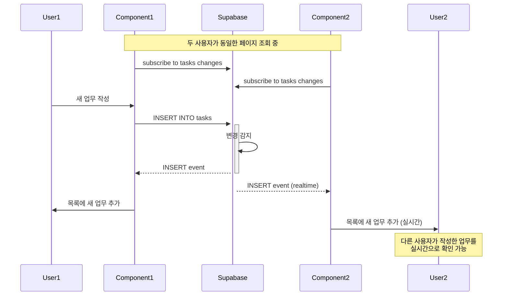

# 시퀀스 다이어그램

## 개요

이 문서는 업무 보고 시스템의 주요 기능에 대한 시퀀스 다이어그램을 제공합니다. 컴포넌트 간 상호작용과 데이터 흐름을 시각화합니다.

---

## 1. 인증 플로우

### 1.1 로그인 시퀀스

```mermaid
sequenceDiagram
    actor User
    participant LoginForm
    participant useAuth
    participant Supabase
    participant authStore
    participant AppRouter

    User->>LoginForm: 이메일, 비밀번호 입력
    User->>LoginForm: 로그인 버튼 클릭

    LoginForm->>+useAuth: signIn(email, password)
    useAuth->>authStore: setLoading(true)

    useAuth->>+Supabase: auth.signInWithPassword()

    alt 인증 성공
        Supabase-->>-useAuth: { user, session }
        useAuth->>authStore: setUser(user)
        useAuth->>authStore: setSession(session)
        useAuth->>authStore: setLoading(false)

        useAuth->>+Supabase: from('members').select()
        Supabase-->>-useAuth: member profile

        useAuth-->>-LoginForm: { data, error: null }
        LoginForm->>AppRouter: Navigate to "/"
        AppRouter->>User: 대시보드 페이지 표시
    else 인증 실패
        Supabase-->>-useAuth: { error }
        useAuth->>authStore: setLoading(false)
        useAuth-->>LoginForm: { error }
        LoginForm->>User: 오류 메시지 표시
    end
```

### 1.2 회원가입 시퀀스

```mermaid
sequenceDiagram
    actor User
    participant LoginForm
    participant useAuth
    participant Supabase
    participant memberAPI
    participant authStore

    User->>LoginForm: 이메일, 비밀번호, 이름, 계정ID 입력
    User->>LoginForm: 회원가입 버튼 클릭

    LoginForm->>+useAuth: signUp(email, password, profile)
    useAuth->>authStore: setLoading(true)

    useAuth->>+Supabase: auth.signUp({email, password})

    alt 가입 성공
        Supabase-->>-useAuth: { user, session }

        useAuth->>+memberAPI: createMemberProfile(user.id, profile)
        memberAPI->>+Supabase: from('members').insert()
        Supabase-->>-memberAPI: member data
        memberAPI-->>-useAuth: member profile

        useAuth->>authStore: setUser(user)
        useAuth->>authStore: setSession(session)
        useAuth->>authStore: setLoading(false)

        useAuth-->>-LoginForm: { data, error: null }
        LoginForm->>User: 가입 성공 메시지
        LoginForm->>User: 이메일 인증 안내
    else 가입 실패
        Supabase-->>-useAuth: { error }
        useAuth->>authStore: setLoading(false)
        useAuth-->>LoginForm: { error }
        LoginForm->>User: 오류 메시지 표시
    end
```

### 1.3 자동 세션 갱신

```mermaid
sequenceDiagram
    participant Browser
    participant useAuth
    participant Supabase
    participant authStore
    participant LocalStorage

    Note over Supabase: 액세스 토큰 만료 5분 전

    Supabase->>useAuth: onAuthStateChange('TOKEN_REFRESHED')

    useAuth->>+Supabase: 리프레시 토큰으로 갱신 요청
    Supabase->>Supabase: 리프레시 토큰 검증

    alt 토큰 유효
        Supabase-->>-useAuth: 새 액세스 토큰 + 세션
        useAuth->>authStore: setSession(newSession)
        useAuth->>LocalStorage: 새 세션 저장
        Note over Browser: 사용자 작업 중단 없이 계속
    else 리프레시 토큰 만료
        Supabase-->>-useAuth: { error: 'Refresh token expired' }
        useAuth->>authStore: clear()
        useAuth->>LocalStorage: clear()
        useAuth->>Browser: Navigate to "/login?reason=session_expired"
    end
```

---

## 2. 업무 보고 플로우

### 2.1 업무 보고 작성

```mermaid
sequenceDiagram
    actor User
    participant TaskForm
    participant businessAPI
    participant useCreateTask
    participant Supabase
    participant TanStackQuery

    User->>TaskForm: 페이지 접속 (/tasks/new)

    TaskForm->>+businessAPI: getCostGroups()
    businessAPI->>+Supabase: from('cost_groups').select()
    Supabase-->>-businessAPI: cost groups data
    businessAPI-->>-TaskForm: 비용 그룹 목록

    User->>TaskForm: 비용 그룹 선택

    TaskForm->>+businessAPI: getServices(costGroupId)
    businessAPI->>+Supabase: from('services').select().eq(...)
    Supabase-->>-businessAPI: services data
    businessAPI-->>-TaskForm: 서비스 목록

    User->>TaskForm: 서비스 선택

    TaskForm->>+businessAPI: getProjects(serviceId)
    businessAPI->>+Supabase: from('projects').select().eq(...)
    Supabase-->>-businessAPI: projects data
    businessAPI-->>-TaskForm: 프로젝트 목록

    User->>TaskForm: 업무 정보 입력
    User->>TaskForm: 제출 버튼 클릭

    TaskForm->>TaskForm: React Hook Form 검증
    TaskForm->>TaskForm: Zod 스키마 검증

    alt 검증 성공
        TaskForm->>+useCreateTask: mutate(taskData)
        useCreateTask->>+Supabase: from('tasks').insert()

        alt DB 삽입 성공
            Supabase-->>-useCreateTask: task data
            useCreateTask->>TanStackQuery: invalidateQueries(['tasks'])
            useCreateTask-->>-TaskForm: success
            TaskForm->>User: 성공 토스트 메시지
            TaskForm->>User: Navigate to "/tasks"
        else DB 삽입 실패
            Supabase-->>-useCreateTask: error
            useCreateTask-->>TaskForm: error
            TaskForm->>User: 오류 메시지 표시
        end
    else 검증 실패
        TaskForm->>User: 필드별 오류 메시지 표시
    end
```

### 2.2 업무 목록 조회



### 2.3 업무 수정

```mermaid
sequenceDiagram
    actor User
    participant TaskForm
    participant taskAPI
    participant Supabase
    participant RLS
    participant PermissionService

    User->>TaskForm: 수정 페이지 접속 (/tasks/edit/:id)

    TaskForm->>+taskAPI: getTask(taskId)
    taskAPI->>+Supabase: from('tasks').select().eq('task_id', id)
    Supabase->>RLS: 조회 권한 확인
    Supabase-->>-taskAPI: task data
    taskAPI-->>-TaskForm: task

    TaskForm->>TaskForm: 폼에 기존 데이터 채우기
    TaskForm->>User: 폼 표시

    User->>TaskForm: 필드 수정
    User->>TaskForm: 수정 버튼 클릭

    TaskForm->>TaskForm: 검증

    alt 검증 성공
        TaskForm->>+taskAPI: updateTask(taskId, updates)
        taskAPI->>+Supabase: from('tasks').update().eq('task_id', id)

        Supabase->>RLS: 수정 권한 확인

        alt 권한 있음 (본인 또는 관리자)
            Supabase->>Supabase: UPDATE tasks SET ...
            Supabase-->>-taskAPI: updated task
            taskAPI-->>-TaskForm: success
            TaskForm->>User: 성공 메시지
            TaskForm->>User: Navigate to "/tasks"
        else 권한 없음
            Supabase-->>-taskAPI: RLS Policy Error
            taskAPI-->>-TaskForm: Authorization error
            TaskForm->>User: "수정 권한이 없습니다" 메시지
        end
    else 검증 실패
        TaskForm->>User: 오류 메시지 표시
    end
```

---

## 3. 권한 검증 플로우

### 3.1 페이지 접근 권한 확인

```mermaid
sequenceDiagram
    actor User
    participant AppRouter
    participant ProtectedRoute
    participant useAuth
    participant usePermission
    participant memberAPI
    participant Supabase

    User->>AppRouter: Navigate to /admin/members

    AppRouter->>+ProtectedRoute: requiredPermission: PERM_06
    ProtectedRoute->>+useAuth: { user, loading }

    alt loading
        useAuth-->>-ProtectedRoute: { loading: true }
        ProtectedRoute->>User: 로딩 스피너 표시
    else not logged in
        useAuth-->>-ProtectedRoute: { user: null }
        ProtectedRoute->>AppRouter: Navigate to "/login"
    else logged in
        useAuth-->>ProtectedRoute: { user }

        ProtectedRoute->>+usePermission: hasPermission(PERM_06)
        usePermission->>+memberAPI: getCurrentMember()
        memberAPI->>+Supabase: from('members').select().eq('auth_id', user.id)
        Supabase-->>-memberAPI: member with role
        memberAPI-->>-usePermission: member

        usePermission->>usePermission: ROLE_PERMISSIONS[member.role].includes(PERM_06)

        alt has permission
            usePermission-->>-ProtectedRoute: true
            ProtectedRoute->>-User: 페이지 표시
        else no permission
            usePermission-->>-ProtectedRoute: false
            ProtectedRoute->>AppRouter: Navigate to "/403"
            AppRouter->>User: 권한 없음 페이지 표시
        end
    end
```

---

## 4. 에러 처리 플로우

### 4.1 API 에러 처리

```mermaid
sequenceDiagram
    participant Component
    participant useCreateTask
    participant taskAPI
    participant Supabase
    participant ErrorHandler
    participant Toast

    Component->>+useCreateTask: mutate(data)
    useCreateTask->>+taskAPI: createTask(data)

    taskAPI->>+Supabase: from('tasks').insert()

    alt Database Error
        Supabase-->>-taskAPI: PostgrestError { code: '23505' }
        taskAPI->>taskAPI: handleSupabaseError()
        taskAPI->>-useCreateTask: throw ValidationError

        useCreateTask->>+ErrorHandler: onError(error)
        ErrorHandler->>ErrorHandler: error instanceof AppError
        ErrorHandler->>+Toast: show({ type: 'warning', message: error.userMessage })
        Toast->>-Component: 토스트 알림 표시
        ErrorHandler->>-useCreateTask: logged
        useCreateTask-->>-Component: { isError: true, error }
    else Network Error
        Supabase-->>-taskAPI: NetworkError
        taskAPI->>-useCreateTask: throw NetworkError
        useCreateTask->>ErrorHandler: onError(error)
        ErrorHandler->>Toast: show({ type: 'error', message: '네트워크 연결 실패' })

        Note over useCreateTask: 재시도 메커니즘
        useCreateTask->>useCreateTask: retry: 3, delay: exponential backoff
    end
```

---

## 5. 상태 관리 플로우

### 5.1 TanStack Query 캐싱



### 5.2 낙관적 업데이트 (Optimistic Update)

```mermaid
sequenceDiagram
    actor User
    participant Component
    participant useMutation
    participant TanStackQuery
    participant API
    participant Supabase

    User->>Component: "업무 완료" 버튼 클릭

    Component->>+useMutation: mutate(taskId)

    Note over useMutation: onMutate (즉시 UI 업데이트)
    useMutation->>+TanStackQuery: getQueryData(['tasks'])
    TanStackQuery-->>-useMutation: current tasks
    useMutation->>useMutation: 백업 저장

    useMutation->>+TanStackQuery: setQueryData(['tasks'])
    Note over TanStackQuery: 해당 task의 status를 'COMPLETED'로 변경
    TanStackQuery-->>-useMutation: optimistic data
    useMutation->>Component: UI 즉시 업데이트
    Component->>User: 완료 상태로 표시 (즉시)

    Note over useMutation,Supabase: 실제 API 호출 (백그라운드)
    useMutation->>+API: updateTask(taskId, { status: 'COMPLETED' })
    API->>+Supabase: UPDATE tasks ...

    alt 성공
        Supabase-->>-API: updated task
        API-->>-useMutation: success
        useMutation->>TanStackQuery: invalidateQueries(['tasks'])
        Note over Component: 정확한 데이터로 재검증
    else 실패
        Supabase-->>-API: error
        API-->>-useMutation: error

        Note over useMutation: onError (롤백)
        useMutation->>+TanStackQuery: setQueryData(['tasks'], backup)
        TanStackQuery-->>-Component: 원래 상태로 복구
        Component->>User: 오류 메시지 + 이전 상태로 표시
    end

    useMutation-->>-Component: complete
```

---

## 6. 실시간 업데이트 플로우 (향후 확장)



---

## 참조 파일

- `src/hooks/useAuth.ts` - 인증 훅
- `src/services/api.ts` - API 서비스
- `src/components/AppRouter.tsx` - 라우팅
- `src/pages/TaskForm.tsx` - 업무 폼
- `src/pages/TaskList.tsx` - 업무 목록

---

**문서 버전**: 1.0
**작성일**: 2025-11-09
**최종 수정**: 2025-11-09
**작성자**: 개발팀
